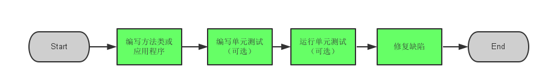
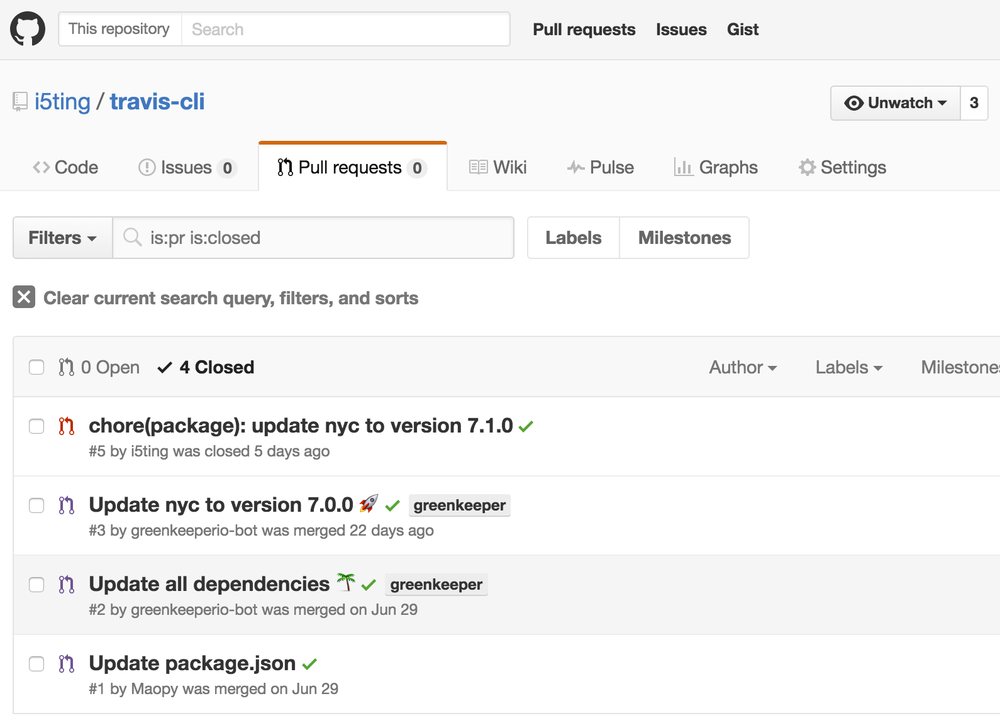
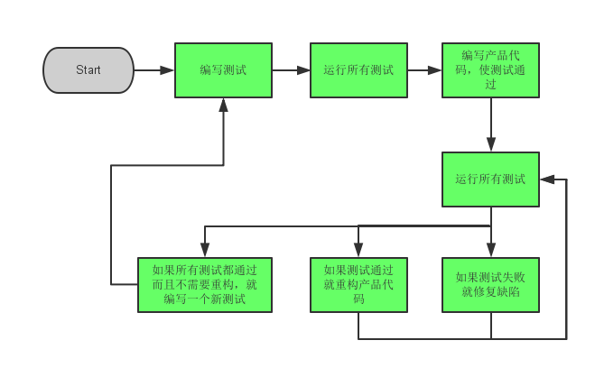

# Node.js测试

待整理

<!-- toc -->

- 什么是测试？
  - 编码境界
  - 测试的好处
  - 红到绿(重构)工作流
  - 单元测试的分类
  - 测试框架举例
- ava是什么？
  - 用法（含gulp）
  - 同步异步
  - 三种：普通函数（promise或thunks）、generator、async函数
  - 断言
  - mock打桩 
- 测试内容
  - api
  - model层
  - 集成测试：zombie
  - cucumber： 
- 自动化 测试流程是什么样的？
  - 任何事情超过 90 秒就应该自动化，这是程序员的终极打开方式。Automating shapes smarter future.
  - ci
    - 使用jenkins自建ci
    - travis-ci
  - 测试覆盖率

# 什么是测试？

根据维基百科的定义：

> 在计算机编程中，单元测试（又称为模块测试, Unit Testing）是针对程序模块（软件设计的最小单位）来进行正确性检验的测试工作。程序单元是应用的最小可测试部件。在过程化编程中，一个单元就是单个程序、函数、过程等；对于面向对象编程，最小单元就是方法，包括基类（超类）、抽象类、或者派生类（子类）中的方法。

JavaScript是基于对象编程的，很长一段时间我们都把js到位前端动态控制的工具。但随着技术的进步，JavaScript已经不局限于前端或后端，而是一种通用性的解决方案。

先看一下前端开发的4个阶段

- html/css/js（基础）
- jQuery、jQuery-ui，Extjs（曾经流行）
- Backbone（mvc），Angularjs、Vuejs（当前流行）
- React组件化（未来趋势）、Vuejs

在很长的一段时间里，前端都忽略了单元测试，或者说对于前端这种UI编程来说，单元测试确实比较麻烦，即便是jQuery这样的神器，也只是能拿QUnit做简单的单元测试，或者使用Selenium，本质上提供了编码型测试，但是因为提供了录制功能，所以广泛被用于录制测试。但随着angularjs的异军突起，让测试变得可行，针对JavaScript的单元测试框架如雨后春笋，比如经典Karma+Jasmine实现自动化测试，前端也逐渐玩起了单元测试。至于react组件化，测试更加简单，前端已经开始流行测试了。

对Node.js里测试框架更是层出不穷，大家都知道Node.js是2009年诞生的，从2010年就有[nodeunit](https://github.com/caolan/nodeunit)，是xUnit类似的实现。

单元测试的重要性是不言而喻的，经常存在的一个误区是：

- 单元测试不是测试人员的事情么？
- 自己为什么要测试自己的代码？
- 单元测试的成本这么高，对于产品开发有意义么？
- 我这么牛，我不需要单元测试！

上面的几点也是我之前怀疑过的，但是觉得现在每一点都是不容置疑的。首先，认为测试是测试人员的事情是不负责的，测试人员更多的应该是针对整体功能，而每一位工程师应该保证自己代码的准确性；其次自己测试自己的代码更多的时候是为了提高效率。如果我写好了一个接口，没有经过测试就直接交给了别人，那么出错之后就需要接着调试，其中所花费的沟通成本会大大大于编码成本，这也顺带解决了第三个疑问；最后，在Github上面所有star过万的repo都应该有自己的测试，我相信这些repo的作者比大部分人都牛，他们都需要不断测试，我们没有理由不去测试。



Node.js能够很容易地建立自动测试并采用测试驱动开发方法学，本章稍后将对之进行解释。Node.js为自动测试提供了一个理想平台，而js有一些很好的测试特性，使得在它们之间进行设计和运行测试变得简单而容易。

从广义上来讲，当今的Web应用程序开发者注重于两种自动测试。第一种是单元测试（Unit Testing），这是以与应用程序其他部分相隔离的方式，指定并检验单个类（或其他小型代码单元）行为的方法；第二种是集成测试（Integration Testing），这是指定并检验多个组件协同工作行为的方法，乃至包括整个Web应用程序。

这两种测试在Web应用程序中都有巨大的价值。单元测试便于创建和运行，当我们在算法、业务逻辑或其他后端基础结构上工作时，单元测试是十分精确的。

集成测试的价值在于它可以模拟用户与UI的交互，并可以覆盖应用程序所使用的整个技术堆栈，包括Web服务器和数据库。集成测试更便于在旧的特性中侦测新的Bug，这称为"回归测试（Regression Testing）"。

## 编码境界

1. 打日志
1. 使用调试工具，进行debug
1. 采用tdd/bdd测试驱动开发

## 测试的好处

JavaScript的单元测试，其实绝大部分人用的不多，原因是被一次次失败和太麻烦而放弃。虽然麻烦但单元测试的重要性是公认的，好的单元测试能保证产品的质量。下面我就试着列举一些测试的好处：

### 自动化

一旦上了测试，只要代码变动，就必须确认测试是否正常，如果不正常，请重构

### 有助于理清思路

一般是测试先行，要知道自己要什么，然后在按照自己需要的去实现。

很多情况都是，拿到需求（可能就几句话），然后开始写代码。。。。写着写着，突发发现哪里不对，然后大改，然后突然人家说要的不是这样的，估计就要重写了。。。。

所以，测试先行，可以很好的解决（避开）这些问题。

- 首先，要知道我测试什么功能
- 在测试用例，要知道我期望的场景：什么场景是正确的，什么场景是错误的
- 准备测试的时候，是要全局思考问题的，测试不只是一个点，只是我们看到的最多是原子的单元测试而已
- 不断梳理测试的过程，就是理解需求的过程
- 当需求变动，一定是先该测试，重复上面过程

### 大项目测试的价值才越大

- 小项目，场景少，手动测试也能搞定
- 大项目，无测试，场景太多，重复性劳动太多，无法保证质量

很多人可能是上手的时候，觉得是小项目，没必要加，结果越写越大。。。再加的时候，觉得工作量太大。。。需求也可能变化。。。。。

还有一部分人是这样的，觉得自己是在赶进度，尽快出东西，把测试的时间省掉。。。

还有一部分更可恨的人，了解测试的必要性，说开发完功能就加测试，然找各种借口，工期，功能太多等，迟迟不加，以至于真正相加的时候，无从下手。狗粮是要有人吃的，技术债也是要有人还的。

> 孙子兵法：夫未战而庙算胜者，得算多也；未战而庙算不胜者，得算少也。多算胜，少算不胜，而况于无算乎！吾以此观之，胜负见矣。

如果项目有变大的可能，还是尽量吧测试加上吧。

### 模块拆分的非常细，彼此依赖很严重

a依赖b，b依赖c，如果c变了，那么a和b都要更新，你需要重新测试，这种情况下，如果同时变动2个模块以上，会有非常大的不确定性。

比如greenkeeper会根据你的package.json里的版本策略，关注依赖模块的最新版本，如果发现有依赖版本，它会自动创建一个pr给你，如果此时你的代码有ci和测试话，github会自动进行测试，标出测试结果。如果你发现所有测试功能都正常，那么你直接merge就好了。



### 无测试，你敢重构？

凡事要有一个基准，方能对比，基准线是基准测试的必要条件，而对于重构来说，测试就是基准线。

> 重构是要保证之前功能的基础上对象代码进行改造

- 如果没有测试，如何保证之前的功能在代码变动之后是正常的？
- 如果没有测试，改一点，测一遍？

### 最小化问题

一般来说，做加法要相对做减法简单一些，原因是可以借鉴的东西非常多，而做减法，你是要在已有的方案里移除一些。这种是容易让人纠结的，所以市面上的软件都是看着功能很多，但真的是核心做的有多好，还真不好说。而那些做的特别专业的，都是习惯减法的，比如微信。

对于软件设计也是一样的，一味的追求大而全的过度设计很难执行的，当你设计完，你发现你可能需要半年甚至更长的时间才能完成，你其实会面临无数中断，真的能坚持写完的人是极少数的。本身开源项目就无利益相关，无强约束的，非常容易被打乱的。

换另外一个角度，从敏捷的mvp（最小可用原型）开始，未尝不是好事。通过迭代的思想，不断地进行完善，继而达到交付的目的。

tdd是敏捷开发的一部分，可以说把测试用到了极致，它的核心也和敏捷一样，

最小化问题的好处

- 简单，涉及的知识点较少，容易学习
-   

### 掌握api的最佳途径

往往我们是用什么学什么，比如读取文件，就不会考虑删除文件api用法。。。这其实是让我们非常被动，但测试为了保正原子性，是遵循“开闭”原则的，即有创建就删除，你自己因为测试需要而产生的所有内容，你必须自己在测试完成后清除他们。

很多场景可能一辈子都不会遇到，测试其实是拓宽了我们的知识面和使用场景。精于测试的人对api都是非常熟练的，至少是不使用测试人的二倍的。

很多人离不开IDE，言必称IDE，究其原因就是对api掌握不牢靠，以至于没有自信去完全手写。对于js这样的语言，真心没必要用那么重的东西，以Node.js开发来说，vscode相对比较轻量级一些，但对我来说还是有点重。

### 测试是一种沟通技能

国人做软件有2个极端，要么过度设计，要么没有设计，这还好，最痛苦的是没有写文档的习惯。

其实测试驱动开发的理念了，测试就文档的。

看一个开源项目的好坏，1）看功能 2）看测试 3）看api和文档，如果测试写的好，就是没有文档也是无所谓的。从这点上看，测试其实就是程序员之间的

## 测试的缺点

- 具有一定的复杂性，可以说测试也是一门艺术
- 一但上了测试，就必须持续编写测试用例，不能中断，不然没意义
- 

## 红到绿(重构)工作流

借助于测试驱动开发（TDD），可以使用单元测试来帮助你进行代码设计。这对习惯于在完成编码之后再进行测试的程序员来说，可能会觉得这是一种古怪的概念（即，原先是先设计功能代码然后再进行测试，现在倒过来了，要先设计测试，然后再设计功能代码，这使你感觉不习惯了--译者注），但这种方法很有意义。关键概念是一种叫"红-绿-重构"的开发工作流。它是这样工作的。

- （1）确定需要给应用程序添加的一个新特性或方法。
- （2）编写测试，以检验该新特性的行为（先测试。--译者注）。
- （3）运行这个测试并得到一个红色信号。
- （4）编写实现这个新特性的代码（后编码。--译者注）。
- （5）再次运行测试并修正其代码，直到得到一个绿色信号。
- （6）必要时重构该代码。例如，重组语句、重命名变量等（重构。--译者注）。
- （7）运行该测试，以确认修改不会改变已添加的这个行为。

对添加的每个特性重复这种工作流。

下面通过浏览一个示例，以使你明白这是如何工作的。假设，我们需要的一个行为是，对一个物品添加一个报价的能力，但这个报价必须高于之前对这个物品的所有报价。首先，对物品类添加一个存根方法（可以把存根方法理解为是一个占位方法。意指已经有这么一个方法存在，但暂时未实现其真正的功能。--译者注），如清单4-8所示。

成功！我们已经实现了这个新特性，它通过了所有单元测试。最后一步是花一些时间并确信，我们的测试确实真正测试了要实现的行为或特性的所有方面。如果是这样，就大功告成了。如果不是，那么就添加更多测试，重复这一循环并继续，直到确信我们有了一组完整的测试集，并且所有的实现全部通过了这些测试。

这种循环是TDD的精髓。有很多人建议把它作为一种开发风格，这不仅仅是因为它使程序员在开始编码之前，就思考如何进行修改和增强。你总是有一个明确的目标，并且有一种检查是否达到目标的方法。而且，如果有了涉及应用程序其余部分的单元测试，就可以确信，你的扩充不会改变其他地方的行为。

形成单元测试信仰

如果你当前尚未对代码作单元测试，你会发觉开发过程笨拙而混乱--输入越多、测试越多、迭代越多。如果你实施了单元测试，就会知道它会产生什么不同：更少的bug、更好的软件设计，并在进行修改时会更少出现奇怪的现象。

从一个非测试者到一个测试者可能是艰苦的。这意味着要接纳一种新的习惯，并坚持足够长的时间才能受益。由于这种意外的迁移，最初的一些尝试在一定时间内会遭遇失败。当时间很紧迫时，要做某些感觉多余的工作，很难让你确信这是有价值的。

我们俩（作者）都已成为单元测试的忠实者，并且承认这是一种伟大的开发风格。如果你以前从未尝试，或曾经尝试过但已放弃，那么ASP.NET MVC是进行单元测试的理想选择。通过把关键类从底层技术中分离出来，微软团队已经使得单元测试过程异常简单。这意味着，你可以对关键特性创建模仿实现，并测试其他方式下难以复现的各种情况。本书将向你演示对MVC应用程序进行单元测试的例子。我们鼓励你遵从并尝试自己进行单元测试。
 

## 单元测试的分类

单元测试根据主流的分类可以分成两类，分别是BDD和TDD

### TDD：测试驱动开发（Test-Driven Development）

测试驱动开发是敏捷开发中的一项核心实践和技术，也是一种设计方法论。TDD的原理是在开发功能代码之前，先编写单元测试用例代码，测试代码确定需要编写什么产品代码。TDD的基本思路就是通过测试来推动整个开发的进行，但测试驱动开发并不只是单纯的测试工作，而是把需求分析，设计，质量控制量化的过程。TDD首先考虑使用需求（对象、功能、过程、接口等），主要是编写测试用例框架对功能的过程和接口进行设计，而测试框架可以持续进行验证。 


TDD的英文全称是Test-Driven Development，即测试驱动开发。测试驱动开发的流程是

- 开发人员写了一些测试代码
- 开发人员跑了这些测试用例，然后毫无疑问的这些测试用例失败了因为测试中提到的类和方法并没有实现
- 开发人员开始实现测试用例里面提到的方法
- 如果开发者写好了某个功能点，他会欣喜地发现之前的相对应的测试用例通过了
- 开发者人员可以重构代码，并添加注释，完成后期工作

这个流程如下图：




### BDD：行为驱动开发（Behavior Driven Development）

行为驱动开发是一种敏捷软件开发的技术，它鼓励软件项目中的开发者、QA和非技术人员或商业参与者之间的协作。主要是从用户的需求出发，强调系统行为。BDD最初是由Dan North在2003年命名，它包括验收测试和客户测试驱动等的极限编程的实践，作为对测试驱动开发的回应。

BDD的英文全称是Behavior-Driven Development，即行为驱动开发。
BDD与TDD的主要区别是在写测试案例的时候的措辞，BDD的测试案例更像是一份说明书，在详细描述软件的每一个功能。 

### 软件开发过程中最常见的两个问题

需求和开发脱节：

- 用户想要的功能没有开发
- 开发的功能并非用户想要
- 用户和开发人员所说语言不同

开发和测试脱节：

- 开发和测试被认为割裂
- 从开发到测试周期过长
- 测试自动化程度低

使用BDD可以解决需求和开发脱节的问题，首先他们都是从用户的需求出发，保证程序实现效果与用户需求一致。

## 测试的好处

- 最小化问题
- 保证质量


## 各种Node.js测试框架

工欲行其事必先利其器，好的单元测试框架是TDD成功的一半。Javascript优秀的测试框架很多, 包括Jasmine，Qunit，JsTestDriver，JSUnit，Mocha等，当然你也可以写自己的单元测试框架，


- Mocha是比较流行的框架
- Vows对异步测试简直拿手的很。尽管有些陈旧
- Expresso 一个更加传统的单元测试框架
- node-unit 另外一个相对传统的单元测试框架

mocha，Jasmine，jest，tap && tape


# ava是什么？

> 很多人不喜欢写测试的原因，根本在于没有体会过测试的乐趣与好处，总以进度等为借口

讲流程控制，你扯到测试框架干什么？看似无关，但实际上测试框架才是对流程控制提供最全的最简洁的集成的，如果通用性的测试框架都解决不好流程控制问题，那么，这样的东西不用也罢。

先简单的介绍一下：[AVA](https://github.com/avajs/ava)是面向未来的测试运行器

简单的说ava是mocha的替代品，

- es6语法支持更好，对aysnc/await有支持
- 执行效率更高，使用io并发，就必须保证测试的原子性
- 语义上更简单，集众家之长

虽然 JavaScript 是单线程，但在 Node.js 里由于其异步的特性使得 IO 可以并行。AVA 利用这个优点让你的测试可以并发执行，这对于 IO 繁重的测试特别有用。另外，测试文件可以在不同的进程里并行运行，让每一个测试文件可以获得更好的性能和独立的环境。在 Pageres 项目中从 Mocha切换 到 AVA 让测试时间从 31 秒下降到 11 秒。测试并发执行强制你写原子测试，意味着测试不需要依赖全局状态或者其他测试的状态，这是一件非常好的事情。

tj曾说：“如果他现在重写mocha，也会写成ava这样”

闲言少叙

- 同步
- callback
- promise
- generator
- async function

举几个例子：

```
test('synchronization', t => {})
test.cb('callback', t => {})
test('promise', t => {})
test('generator function',  function * (t) {})
test('async function', async t => {})
```

大家了解这几种写法的区别么？

总结一下就是：

- test和test.cb是两种：同步和callback处理。
- 在test里，第二个参数有3种写法，普通函数、Generator函数和Async函数。

它们就是我们的主角，几乎所有的流程控制都在里面了。看一个模块或者框架，如果能这样比较，就非常容易看到它们的本质，一般都是写的人比用的人精，但用的人也可以变成写的人，是不是？

## 准备

```
$ npm init
$ npm i -D ava
$ npm i -D co-exec
```

## 测试

### 同步

js语言里除了ajax、setTimeout等大部分都是同步，写同步代码是一种幸福，稍后你就懂了

1.js

```
import test from 'ava';

test('synchronization', t => {
  const a = /foo/;
  const b = 'bar';
  const c = 'baz';
  t.false(a.test(b) || b === c);
});


```

###  异步

但是我们习惯回调，无论事件还是ajax，都是异步的。另外Node.js里又为了性能而异步，即所谓的天生异步，每个api都是异步的。

以Node.js为例

- error-first callback（错误优先的回调机制）
- EventEmitter （事件发射机制）

总结，callback是用的最多的，是绝大部分的api遵守的约定，而EventEmitter是辅助机制，通过继承EventEmitter，来解耦业务逻辑。

2.js

```
import test from 'ava';
const exec = require('child_process').exec

test.cb('error-first callback with setTimeout', t => {
    setTimeout(() => {
      t.pass();
      t.end();
    }, 2000);
});

test.cb('error-first callback with exec', t => {
  exec('cat *.js bad_file | wc -l',
    function (error, stdout, stderr) {
      t.pass();
      t.end();
  });
});
```

###  promise


> 为了让大家从回调的地狱中回到天堂，Promise你值得拥有

Promise是一种令代码异步行为更加优雅的抽象，有了它，我们就可以像写同步代码一样去写异步代码。它是从Common JS规范分裂出来的，目前主流是[Promose/A+](https://promisesaplus.com)规范。

jQuery很早就引入了Promise的概念，主要是deffered和promise对象。而在Angularjs里也有类似的实现，叫$q，其实是promise库q的精简版。

先看测试，后面会详细讲

3.js

```
import test from 'ava';

// promise
test('promise', t => {
  return Promise.resolve(3).then(n => {
      t.is(n, 3);
  });
});

```

###  generator

generator是es6的一个特性，本身是用于计算的，通过generator和yield写的代码看起来像同步的，主要是yield来处理同步的事儿，但yield又只能在generator里。

在ava里是generator特别简单

4.js

```
import test from 'ava';

var exec = require('co-exec');

test('generatorFn with exec()', function * (t) {
    let commit = yield exec('ls -alt|grep .gitignore|wc -l');
    t.true(commit == 1);
});
```

###  async function

generator执行的时候，需要先生成对象，然后next进行下一步。这样做起来还是比较麻烦，能不能不需要执行器啊？于是async函数就应运而生了。

async函数es7 stage-3的特性，可惜差一点就进入到es7规范了。async函数里使用await可以做到和yield类似的效果，但await只能接promise对象。

5.js

```
import test from 'ava';

test('async function', async t => {
    const bar = Promise.resolve('bar');

    t.is(await bar, 'bar');
});
```

## 执行

```
➜  asynchronous-flow-control git:(master) ✗ ava -v *.js

  ✔ 1 › synchronization
  ✔ 2 › error-first callback with exec
  ✔ 3 › promise
  ✔ 4 › generatorFn with exec()
  ✔ 5 › async function
  ✔ 2 › error-first callback with setTimeout (2s)

  6 tests passed [09:48:27]

➜  asynchronous-flow-control git:(master) ✗ ava -v *.js -s

  ✔ 1 › synchronization
  ✔ 2 › error-first callback with setTimeout (2s)
  ✔ 2 › error-first callback with exec
  ✔ 3 › promise
  ✔ 4 › generatorFn with exec()
  ✔ 5 › async function

  6 tests passed [09:48:35]
```

说明

- 第一个是并行的，所以顺序有点乱
- 第二个是顺序执行 `-s`


普通函数、Generator函数和Async函数

在test里，第二个参数有3种写法：普通函数、Generator函数和Async函数。

#####（1）普通函数

“callback hell”译为回调地狱，回调都有地狱，可见大家对callback的厌恶程度。诚然，过多嵌套回调的代码是非常难以维护的，可读性极差，例如以下代码。

```
step1(function (value1) {
    step2(value1, function(value2) {
        step3(value2, function(value3) {
            step4(value3, function(value4) {
                // Do something with value4
            });
        });
    });
});
```

我要说的是以下两点：

- 前端如AJAX，后端如Node.js，回调是躲不过去的
- 回调不止js有，其他语言也有

不要逃避callback，而是想办法解决它，把callback转成普通函数，主要有2种解决方式：Thunk 和 Promise。

<FONT COLOR=#26B4FD>**Thunk**</FONT>

Thunk是什么?可以从以下几点来理解：

- Thunk 是一个被封装了同步或异步任务的函数；
- Thunk 有唯一一个参数 callback，是 CPS 函数；
- Thunk 运行后返回新的 Thunk 函数，形成链式调用；
- Thunk 自身执行完毕后，结果进入 callback 运行；
- callback 的返回值如果是 Thunk 函数，则等该 Thunk 执行完毕将结果输入新 Thunk 函数运行；如果是其它值，则当做正确结果进入新的 Thunk 函数运行；

在 JavaScript 语言中，Thunk 函数替换的不是表达式，而是多参数函数，将其替换成单参数的版本，且只接受回调函数作为参数。

在以下代码中，fs模块的 readFileAPI方法是一个多参数函数，两个参数分别为文件名和回调函数。经过转换器处理，它变成了一个单参数函数，只接受回调函数作为参数。这个单参数版本，就叫做 Thunk 函数。

```
// 正常版本的readFile（多参数版本）
fs.readFile(fileName, callback);

// Thunk版本的readFile（单参数版本）
var readFileThunk = Thunk(fileName);
readFileThunk(callback);

var Thunk = function (fileName){
  return function (callback){
    return fs.readFile(fileName, callback); 
  };
};
```

曾经大家都钟爱函数式、高阶函数、cps等，但Promise目前基本已经成为默认标准了，Thunk用的会越来越少，但函数式的一些好的有点还是值得学的。

<FONT COLOR=#26B4FD>**Promise/a+**</FONT>

顺序执行的代码和错误有限的回调方式都是js引擎默认支持的，这部分大家会调用接口，无太多变化，而Promise是对callback的思考，或者说改良方案，目前使用非常普遍，这里详细讲解一下。

Promise最早是在commonjs社区提出来的，当时提出了很多规范。比较接受的是Promise/A规范。后来人们在这个基础上。提出了Promise/A+规范，也就是实际上的业内推行的规范。ES6也是采用的这种规范。

Promise对象用于异步技术中。Promise意味着一个还没有完成的操作（许愿），但在未来会完成的（实现）。

Promise表示一个异步操作的最终结果。与Promise最主要的交互方法是通过将函数传入它的then方法从而获取得Promise最终的值或Promise最终最拒绝（reject）的原因。可以从以下几点来理解Promise：

- 递归，每个异步操作返回的都是Promise对象
- 状态机：三种状态（pending, fulfilled 或 rejected）转换，只在Promise对象内部可以控制，外部不能改变状态
- 全局异常处理
- 每个函数的返回值都是Promise对象
- 和jQuery一样的链式的thenable写法

这里给出一个gif演示，便于大家学习。


如下图所示，标准的Promise只有5个核心API，所以还是比较容易学的。


先掌握着5个API，然后再熟悉bluebird，q这样的Promise库，它们做了大量的扩展而已，但核心本质还是这些的。

callback hell
更多相关资料请参考<FONT COLOR=#336DB7>《Node.js最新技术栈之Promise篇》（https://cnodejs.org/topic/560dbc826a1ed28204a1e7de）</FONT>。

##### （2）生成器Generators/yield

Generator Function（生成器函数）和Generator（生成器）是ES6引入的新特性，该特性早就出现在了Python、C#等其他语言中。生成器本质上是一种特殊的<FONT COLOR=#336DB7>迭代器https://developer.mozilla.org/zh-CN/docs/Web/JavaScript/Guide/The_Iterator_protocol</FONT>。

Generator函数本意是iterator生成器，函数运行到yield时退出，并保留上下文，在下次进入时可以继续运行。

生成器函数也是一种函数，语法上仅比普通function多了个星号* ，即function* ，在其函数体内部可以使用yield和yield* 关键字。

简单理解，这是ES6的新特性，function 后面带 * 的叫做Generator，如以下代码所示。

```
function* doSomething() {
  ....
}
```

先看一下Generator如何执行：

```
function* doSomething() {
    console.log('1');
    yield; // Line (A)
    console.log('2');
}

var gen1 = doSomething();

gen1.next(); // Prints 1 then pauses at line (A)
gen1.next(); // resumes execution at line (A), then prints 2
```

**说明**

- gen1是产生出来的Generator对象
- 第一个next，会打印出1，之后悬停在 yield所在行，即Line (A)
- 第二个next，恢复line (A)点的执行，之后打印出2

如果有多个yield呢？那么会有无穷无尽的next。

于是tj就写[co](https://github.com/tj/co)这个著名的Generator执行器，co目前已经是v4了，彻底的面向Promise了，个中曲折也是够八卦的了。

##### （3）Async函数/Await（以前说是ES7 stage-3）

Generator的弊病是没有执行器，它本身就不是为流程控制而生的，所以co的出现只是解决了这个问题。

可是，你不觉得奇怪么？为什么非要加个co，才能好好的玩耍？为什么不能是直接就可以执行，并且效果和Yieldable一样的呢?

Async/Await 就是这样被搞出来的，很多人认为它是异步操作的终极解决方案。

<FONT COLOR=#26B4FD>**Await**</FONT>

Await的3种可能情况

- Await + Async函数
- Await + Promise
- await + co（co会返回Promise，这样可以Yieldable，但难度较大，适合老手）

头2种是比较常用的，第三种co作为promise生成器，是一种hack的办法。

下面给出第一种和第二种的示例：

```
async function a2() {
  return new Promise((resolve, reject) => {
    setTimeout(resolve, 1000);
  })
}

async function a1() {
  console.log("hello a1 and start a2");
  await a2();
  console.log("hello end a2");
}

async function a0() {
  console.log("hello a0 and start a1");
  await a1();
  console.log("hello end a1");
}

a0()
```

**执行**

需要使用babel或者其他支持async函数的编译工具，这里使用runkoa（是为koa支持async函数做的基于babel的简单封装）

```
$ runkoa async.js
async.js
3babel presets path = /Users/sang/.nvm/versions/node/v4.4.5/lib/node_modules/runkoa/node_modules/
hello a0 and start a1
hello a1 and start a2
hello end a2
hello end a1
```

**异常处理**

Node.js里关于异常处理有一个约定，即同步代码采用try/catch，非同步代码采用error-first方式。对于Async函数俩说，它的Await语句是同步执行的，所以最正常的流程处理是采用try/catch语句捕获，和generator/yield是一样的。

下面的代码所展示的是通用性的做法：

```
try {
  console.log(await asyncFn());
} catch (err) {
  console.error(err);
}
```

很多时候，我们需要把异常做得粒度更细致一些，这时只要把Promise的异常处理好就好了。

Promise里有2种处理异常的方法

- then(onFulfilled, onRejected)里的onRejected，处理当前Promise里的异常
- catch处理全局异常


**Async函数总结**

- Async函数语义上非常好
- Async不需要执行器，它本身具备执行能力，不像Generator
- Async函数的异常处理采用try/catch和Promise的错误处理，非常强大
- Await接Promise，Promise自身就足够应对所有流程了
- Await释放Promise的组合能力，外加Promise的then，基本无敌

## 断言


## stub && mock


stub是伪造方法

```
Stub:

For replacing a method with code that returns a specified result
```

mock是伪造对象 

```
Mock:

A stub with an expectations that the method gets called.
```

https://github.com/rspec/rspec-mocks#mock-objects-and-test-stubs

There is a lot of overlapping nomenclature here, and there are many variations of these patterns (fakes, spies, etc). Keep in mind that most of the time we're talking about method-level concepts that are variations of method stubs and message expectations, and we're applying to them to one generic kind of object: a Test Double.


sinon 与 rosie

- http://jaketrent.com/post/sinon-spies-vs-stubs/ 推荐
- https://semaphoreci.com/community/tutorials/best-practices-for-spies-stubs-and-mocks-in-sinon-js

# 测试内容

## api
## model层
## 集成测试
  
> 集成测试是对一个工作单元进行的测试，这个测试对被测试的工作单元没有完全的控制，并使用该单元的一个或多个真实依赖物，例如时间、网络、数据库、线程或随机数产生器等。

总的来说，集成测试会使用真实依赖物，而单元测试则把被测试单元和其依赖物隔离开，以保证单元测试结果高度稳定，还可以轻易控制和模拟被测试单元行为的任何方面。


对Web应用程序来说，集成测试最常用的办法是UI自动化（UI Automation）。此术语是指，通过再现用户要执行的动作，模拟或自动操作一个Web浏览器来演练应用程序的整个技术堆栈，如点击按钮、跟踪超链接，以及递交表单等。以下是提供给.NET开发者的两个最著名的开源的浏览器自动化工具。

Selenium RC（http://seleniumhq.org/），它含有一个Java的"服务器"应用程序，它可以把自动化命令发给IE、Firefox、Safari、Opera、.NET客户端、Python、Ruby以及许多其他浏览器，以使你可以用自己所选择的语言来编写测试脚本。Selenium功能强大且成熟，他唯一的缺点是你必须运行它的Java服务器。

WatiN（http://watin.souceforge.net），这是一个可以把自动化命令发给IE或Firefox的.NET库。它的API不如Selenium那么功能强大，但它能轻松地处理最常见的情形，而且它很容易建立（只需要引用一个动态链接库）。

集成测试是单元测试的一种理想的补充。在单元测试很恰当地检验了单个组件在服务器上的行为情况下，集成测试让你创建了致力于客户端的测试，再生了用户的行为。结果，它可以标记出组件之间因交互而出现的问题--因此称之为"集成测试（Integration Testing）"。而且，由于Web应用程序的集成测试是通过浏览器完成的，你可以测试JavaScript的行为是否按照它们预计的方式在工作，单元测试很难做到这些。

当然，集成测试也有一些缺点，它需要花费更多的时间。创建测试需要更长的时间，执行这些测试也需要更长的时间。而且，集成测试可能是脆弱的。如果我们修改一个测试中需要检查的某个组件的ID属性很可能导致测试失败。

由于需要额外的时间和努力，集成测试通常在项目的关键点上实施，这可能是一周的源代码审查，也可能是主要功能模块完成时。集成测试与单元测试一样有用，而且它能够突出单元测试所不能发现的问题。建立和运行集成测试的时间是值得的，我们鼓励你把它纳入你的开发过程。

本书不打算介入集成测试。并非我们认为它没用--它是有用的，所以，我们极力主张把它纳入你的开发过程--只是因为它超出了本书的焦点。ASP.NET MVC框架作了特别设计，以使单元测试容易而简单，而且本书也需要涵盖单元测试，以使你充分品味如何建立一个良好的MVC应用程序。集成测试是一种不同的艺术，而且，当在任何Web应用程序上执行集成测试为真的东西对MVC亦为真。

zombie

## cucumber： 

# 自动化 测试流程是什么样的？

> 任何事情超过 90 秒就应该自动化，这是程序员的终极打开方式。Automating shapes smarter future.


## ci

CI server

CI(Continuous Integration)服务器的用处是每次有人Commit就会自动执行编辑及测试，并回报结果，如果有人送交的程式搞砸了回归测试，馬上就有反馈可以知道。推荐第三方的服务包括：

https://travis-ci.org
https://www.codeship.io
https://circleci.com

如果自己架设的話，推荐老牌的Jenkins。

### 使用jenkins自建ci


### travis-ci

I use the service of Travis-CI now for a year. In that time the continuous integration has often pointed out problems I never had on my machine and let me quickly fix them, while I still know what the last change was about. If you don’t already use a service like Travis-CI you definitely should go and activate it. Here are 5 points on why this is a good decision.

#### Easy Set-up

The initial configuration of Travis-CI was done in a few minutes. Getting an account, hocking-up the Git repository and adding a .travis.yml file was easy and straight forward. Doing that in Ruby or in Java required only a quick read of the documentation and all was ready to go. More special settings likeallowed failures are easy to implement as well, even when you don’t need them at first.

#### Always there

As soon as Travis-CI is up and running you don’t have to think about it. When you commit a change then a build will be triggered automatically and as long as everything works as expected, you will hear nothing. You don’t have to start another machine or do some manual work – all is cared for and just works.

#### A Safety Net

The big benefit of continuous integration comes when something stops working. At that point you get an email that informs you about the problem and you can act. The faster you push your commits, the faster you will get feedback. Most of the time that will be so fast that you still can remember what your last change was all about. Without having to figure out your code you can fix the problem faster.The same is true for missing files: If you forget to commit a file the build succeeds on your machine, while the build server catches that error and sends you a reminder.

#### Better Tests

When your test suite runs with every build you quickly find out which tests are reliable and which are not. With that you can act quickly and improve your tests, long before you stop trusting them for all their false alarms. With not much additional effort you soon know what works and which parts you better test using a different approach.

#### Uncovered Environmental Problems

As soon as your development environment works you stop updating it. Every change could break it and you will end up with projects that only can be built on one machine. Having a build server that always creates the whole environment from scratch prevents you from ending in such an environment. As soon as something no longer can be installed or configured you get an alarm. Don’t ignore those problems and fix them – that will prevent simple problems from turning into big ones.(Your .travis.yaml file will soon be an up-to-date instruction for setting up your environment, which is another benefit you get for free.)

Conclusion

Travis-CI saved me hours in the last year with an early alarm for every problem one of my projects had. With such a simple set-up you will not have to wait long until Travis-CI saves you time as well. If you use it in an Open Source project you get all the benefits for free .

## 测试覆盖率
  
  
  

